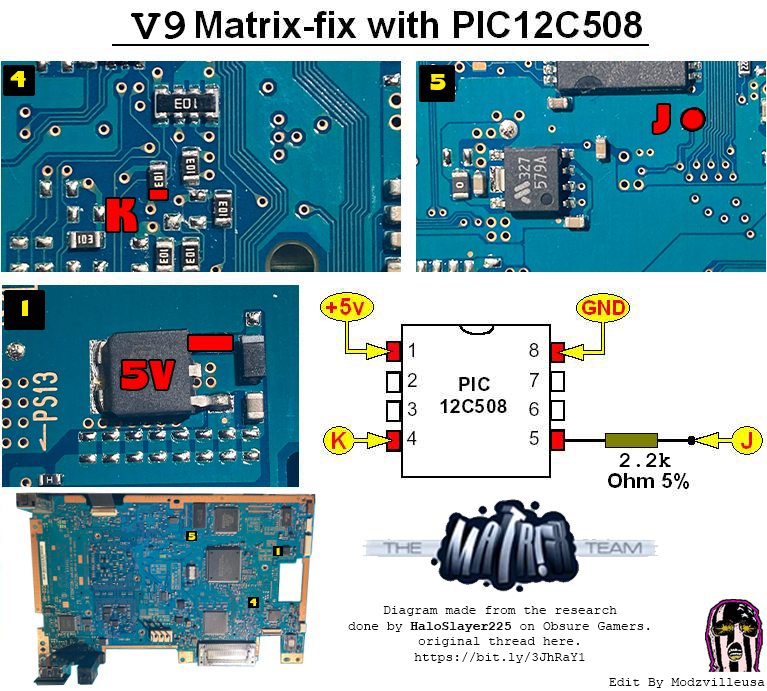
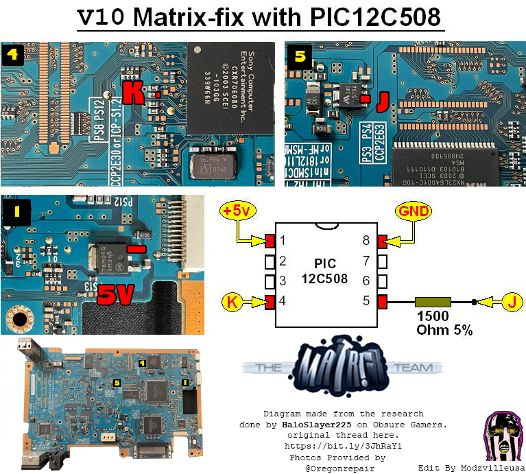
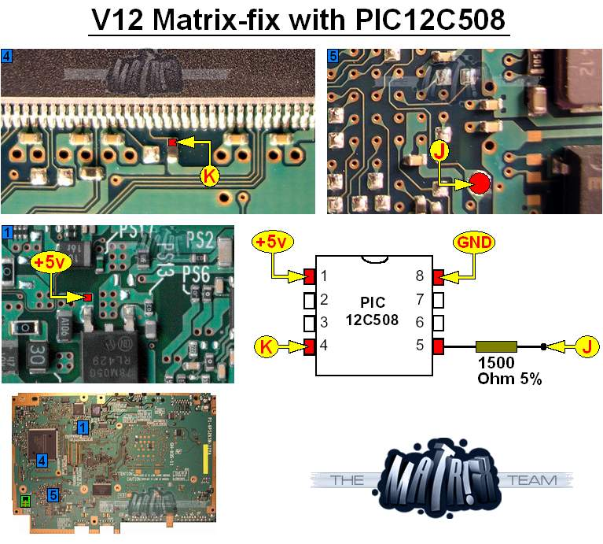

# PIC fix

All FAT and some 70k models are affected by the DSP bug and need hardware fix to avoid frying.

In 2004 the Matrix team developed the so-called "PIC fix". It consists of PIC12C508 (SOIC chips, it's important, dont use MSOP chips) and a resistor 1.5kOhm or 2.2kOhm (resistance depends on your system). PIC12C508 should be programmed with shipped `MFIX_H8.HEX` or `MFIX_H16.HEX` firmware file. Details on how to program this chip aren't covered here. Optionally, you can use Gerber developed board. Also, you can use a [PCB board](https://oshpark.com/shared_projects/3D5p1xeY) developed for Comsoft fix but also suitable for Matrix PIC fix. For experiments, there is also a Comsoft v4 firmware file, however, it is not tested. Note, that the Matrix team Readme is kept there for reference. There is no need to apply the so-called "diode fix" - per our investigations it is useless.

## Board revisions

Historically, hackers use board naming based on versioning, like v10, while sony uses either chassis or Mainboard model. Below is the table for our needs:

| Unofficial version  | Chassis  | Mainboard  |
|---|---|---|
| v9    | H-chassis, 50k  | GH-023  |
| v10   | I-chassis, 50k  | GH-026  |
| v11   | J-chassis, 50k  | GH-029  |
| v12.1 | K-chassis, 70k  | GH-032/GH-035  |
| v12.2 | K-chassis, 70k  | GH-032/GH-035  |
| v13   | K-chassis, 70k  | GH-032/GH-035  |

### FAT 50k

Chassis can be recognized by different methods. The safest, by the DVD player version. In the PS2 browser press Triangle and check the DVD Player version:

- 3.00 this is H-chassis (v9)
- 3.02 this is I-chassis (v10)
- 3.03/3.04 this is J-chassis (v11)

It is also possible to recognize Chassis by sticker, but be careful, a case can be replaced, so data may be inaccurate. But this can at least help when you are buying a console and can get only photos of them.

- if there is a single `J` letter (for example `J SZMT`) - this is J-chassis (v11)
- if there is a single `I` letter (for example `I SKD`) - this is I-chassis (v10)
- if there is a single `H` letter (for example `H FOXC`) or if there are no single letters `H`, `I` or `J` at all - this is H-chassis (v9)

Below 2 diagrams for v9 and v10. The v11 diagram is missing but it should be the same as v10.

### Slim 70k

70k is much harder to differentiate. There exist 3 board revisions and all 3 can be of any mainboard, any mechacon revision and share the same K-chassis. v13 doesn't need the fix (Sony started to apply their fix since this model), while v12.1 and v12.2 share the same fix. v12.1 uses separate EE and GS chips, while v12.2 and v13 use combined EE+GS chip. Probably the only way to differentiate these boards (without disassembling): check their GS chip revision with PS2Ident for example;

- 1.11 - v12.1
- 1.12 - v12.2
- 1.13 - v13

However, it can be that v12.2 and v13 detection cannot be done via software. Below diagram for v12.1 and v12.2.

## Credits

ModzvilleUSA for actual resistor values and testing them on FATs. HaloSlayer255 for researches.

## Sources

- <https://www.obscuregamers.com/threads/ps2-matrix-pic-fix-hex.1825/>
- <https://www.obscuregamers.com/threads/comsoft-v4-fix-confirmed.2978/>
